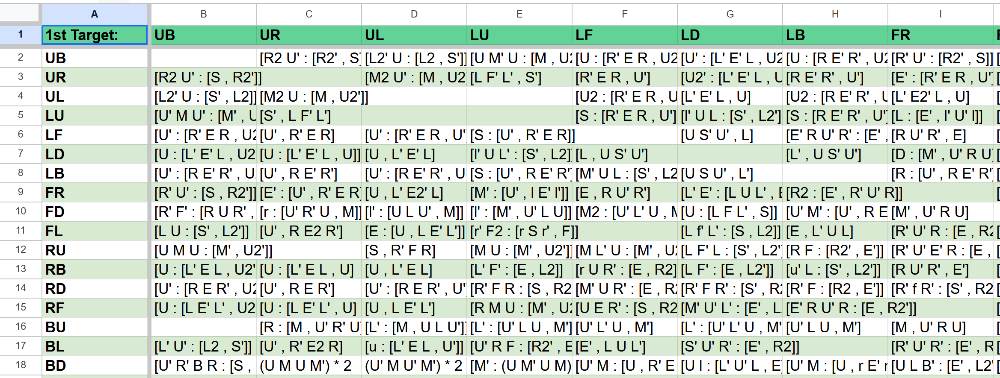

# 2D Table To 1D Table Conversion for Anki Flashcards

## Description 

This is an AutoHotKey script for translating a 2d table in a spreadsheet into a 1D table suitable to import into Anki as 
flashcards. 

It was made for tables containing commutators and letter pairs for blind solving, so it assumes some features of your table that you may not have. You'll need to format your table specifically to use this, or edit the code to your liking. 

AutoHotKey is a Windows-only tool. If you want a spreadsheet converted and don't have a Windows computer, consider asking a friend to use this software for you. 

## Table of Contents

* [Installation](#installation)
* [Configuration](#configuration)
    * [Time Delay](#time-delay)
* [Usage](#usage)
* [Features](#features)
* [Contributing](#contributing)
* [License](#license)

## Installation

To use this software, you first need to have [AHK v2 installed](https://www.autohotkey.com/docs/v2/howto/Install.htm). 

You can then download this repository by clicking the big green `Code` button and selecting `Download ZIP`. 

## Configuration

This tool assumes that you have formatted your table in a specific way. If you haven't, it might not work as expected. See the end of this section for an example of a correctly formatted table. 

Additonally, this tool needs to know how to tell where the end of the table is. To tell it where the end of the table is, you must open the script in Notepad or a similar program, and find these two lines of code near the top. 

```
columnTerminator := "W"
rowTerminator := "W"
```

If your table is correctly formatted per the example below, its first row and column will be headers. To configure the script properly, replace the letter `W` for both the `columnTerminator` and the `rowTerminator` with whatever the the header is for your final column and final row.

Here's the example of a properly formatted table. 



### Time Delay

Since spreadsheets can be somewhat slow, this script includes a delay between its actions. 

Decreasing the delay speeds the script up, but increases the chances the spreadsheet will not properly register the script's navigation. 

Increasing the delay slows the script down, but may fix any failures to properly collect the table information. 

To change the delay, look for this line of code near the top of the script:

```
timeDelay := 100 
```

The delay is measured in milliseconds.

## Usage 

Once you've properly configured the script you're ready to use it. Double click the `.ahk` file to run the script, then open your spreadsheet. 

Select the top left corner cell, the one that says "1st Target:" in the example image, and press the `1` key on your keyboard. This will activate the script, prompting it to automatically scan and copy your table using the arrow keys. 

Don't navigate away from your spreadsheet at this time. To cancel the scan, press `Esc`.

Once the script is finished, it will generate a `.txt` file in the folder it's stored in that's ready to be imported into Anki. You may wish to double check that everything looks correct before proceeding.

## Features

In addition to the already mentioned features, the script will (should) automatically filter empty cells and exclude them from the generated text file. 

## Contributing

This is pretty barebones, and therefore somewhat inflexible and lacking in user-friendly features like a UI. Feel free to fork and make a pull request, or open an issue. 

Converting piece names to Speffz or Chichu could be an interesting area for improvement, as well as adding the ability to include tags for Anki. 

## [License](./LICENSE)
This website uses the open-source MIT License.

--- 